### Phase 1: Deep Discovery & Inventory

| Service Name | Entities Found | Persistence Type |
| --- | --- | --- |
| backpi | PatientContact, SOSRequest, User (Enums: RelationType, Role, TypeAlerte) | JPA/SQL |
| collab-service | AdminAuditLog, AppGuidance, ChatGroup, Comment, GroupJoinRequest, MedicationComplianceLog, Message, MessagePollOption, Notification, Publication, PublicationPollOption, SafetyAlertLog (Enums: GroupCategory, JoinRequestStatus, MessageType, ModerationReason, ModerationStatus, PublicationType, SafetyAlertStatus, SafetyAlertType) | MongoDB |
| donation-service | AppConfig, Donation, DonationCampaign | Plain POJO |
| education-service | AudioExchange, AudioQuestion, AudioSession, Event, EventSeat, PatientActivity (Enums: Activity, SeatStatus) | Plain POJO |
| geo-service | GeoAlert, Hospital, HospitalPrediction, Incident, LocationRecognition, PatientLocation, RecommendedHospital, SOSRequest, SafeZone (Enums: IncidentStatus, IncidentType, Role, TypeAlerte) | MongoDB |
| patient-medecin-service | Analyse, JeuCognitif, Notificationpatient, Patient, UserInfo (Enums: RappelQuotidien) | MongoDB |
| rendezvous-service | RendezVous (Enums: StatutRendezVous) | MongoDB |
| smartwatch-service | HeartRateRecord | MongoDB |

### Phase 3: PlantUML Construction

```plantuml
@startuml
skinparam linetype ortho
skinparam packageStyle rectangle

package "backpi" {
  class PatientContact {
    id : Long
    patientUserId : Long
    contactUserId : Long
    relationType : RelationType
    nom : String
    prenom : String
    email : String
    telephone : String
    createdAt : LocalDateTime
  }
  enum RelationType {
  }
  enum Role {
  }
  class SOSRequest {
    latitude : Double
    longitude : Double
  }
  enum TypeAlerte {
  }
  class User {
    id : Long
    nom : String
    prenom : String
    email : String
    password : String
    role : Role
    telephone : String
    image : String
    actif : boolean
    isLive : boolean
    createdAt : LocalDateTime
    patientId : Long
    relationId : Long
    lienAvecPatient : String
    fcmToken : String
  }
}

package "collab-service" {
  class AppGuidance {
    id : String
    pageName : String
    pageLabel : String
    instructions : List<String>
    updatedAt : Instant
    updatedByUserId : Long
  }
  class ChatGroup {
    id : String
    name : String
    category : GroupCategory
    description : String
    tags : List<String>
    theme : String
    createdAt : Instant
    memberIds : Set<Long>
    ownerId : Long
    isDefault : boolean
    defaultForRole : String
  }
  class Comment {
    id : String
    content : String
    createdAt : Instant
    authorId : Long
  }
  enum GroupCategory {
  }
  class GroupJoinRequest {
    id : String
    userId : Long
    groupId : String
    groupName : String
    groupOwnerId : Long
    status : JoinRequestStatus
    createdAt : Instant
  }
  enum JoinRequestStatus {
  }
  class Message {
    id : String
    content : String
    mediaUrls : List<String>
    mimeTypes : List<String>
    mediaUrl : String
    mimeType : String
    sentAt : Instant
    senderId : Long
    receiverId : Long
    chatGroupId : String
    parentMessageId : String
    parentMessageContent : String
    sharedPublicationId : String
    isDistressed : boolean
    sentimentScore : Double
    isPinned : boolean
    viewedByUserIds : List<Long>
    type : MessageType
    pollQuestion : String
    pollOptions : List<MessagePollOption>
  }
  class MessagePollOption {
    id : String
    text : String
    votesCount : int
    voterIds : Set<Long>
  }
  enum MessageType {
  }
  enum ModerationReason {
  }
  enum ModerationStatus {
  }
  class Notification {
    id : String
    userId : Long
    content : String
    type : String
    isRead : boolean
    createdAt : Instant
  }
  class Publication {
    id : String
    content : String
    tags : List<String>
    mediaUrls : List<String>
    mimeTypes : List<String>
    mediaUrl : String
    mimeType : String
    type : PublicationType
    createdAt : Instant
    authorId : Long
    comments : List<Comment>
    isDistressed : boolean
    sentimentScore : Double
    anonymous : boolean
    pollQuestion : String
    pollOptions : List<PublicationPollOption>
    chatGroupId : String
    chatGroupName : String
    linkedEventId : String
    moderationStatus : ModerationStatus
    moderationReason : ModerationReason
    moderationFlaggedAt : Instant
    supportIds : String
  }
  class PublicationPollOption {
    id : String
    text : String
    votes : int
    voterIds : Set<Long>
  }
  enum PublicationType {
  }
  class AdminAuditLog {
    id : String
    adminId : Long
    action : String
    targetId : String
    targetType : String
    details : String
    performedAt : Instant
  }
  class MedicationComplianceLog {
    id : String
    patientId : Long
    tookMedication : boolean
    createdAt : Instant
  }
  class SafetyAlertLog {
    id : String
    patientId : Long
    alertType : SafetyAlertType
    status : SafetyAlertStatus
    createdAt : Instant
  }
  enum SafetyAlertStatus {
  }
  enum SafetyAlertType {
  }
}

package "donation-service" {
  class AppConfig {
  }
  class Donation {
    id : String
    amount : Double
    donorFirstName : String
    aiSummary : String
    aiGeneratedAt : Date
    donorLastName : String
    donorEmail : String
    donorPhone : String
    paymentMethod : String
    anonymous : Boolean
    message : String
    campaignId : String
    stripeSessionId : String
    status : String
    createdAt : LocalDateTime
  }
  class DonationCampaign {
    id : String
    title : String
    description : String
    goalAmount : Double
    currentAmount : Double
    imageUrl : String
    active : Boolean
    aiSummary : String
    createdAt : LocalDateTime
  }
}

package "education-service" {
  enum Activity {
    id : String
    title : String
    type : ActivityType
    stade : Stade
    description : String
    data : String
    estimatedMinutes : Integer
    active : Boolean
    createdAt : LocalDateTime
  }
  class AudioExchange {
    speaker : String
    text : String
    timestamp : LocalDateTime
  }
  class AudioQuestion {
    questionText : String
    expectedAnswer : String
    patientAnswer : String
    analysisStatus : String
    feedbackText : String
    hintText : String
    attempts : int
    completed : boolean
    keyInfoReinforced : boolean
  }
  class AudioSession {
    id : String
    activityId : String
    patientId : String
    sessionStatus : String
    summary : List<String>
    questions : List<AudioQuestion>
    currentQuestionIndex : int
    totalQuestions : int
    correctAnswers : int
    partialAnswers : int
    incorrectAnswers : int
    silenceCount : int
    finalSummary : String
    language : String
    transcriptHistory : List<AudioExchange>
    createdAt : LocalDateTime
    updatedAt : LocalDateTime
  }
  class Event {
    id : String
    title : String
    startDateTime : LocalDateTime
    location : String
    description : String
    remindEnabled : Boolean
    userId : Long
    activityId : String
    imageUrl : String
    capacity : Integer
    availablePlaces : Integer
    createdAt : LocalDateTime
  }
  class EventSeat {
    id : String
    eventId : String
    seatNumber : String
    status : SeatStatus
    bookedByUserId : Long
    bookedAt : LocalDateTime
  }
  class PatientActivity {
    id : String
    userId : Long
    activityId : String
    scoreCumule : Long
    scoreSession : Long
    bonnesReponses : Integer
    mauvaisesReponses : Integer
    reussi : Boolean
    dureeSecondes : Integer
    playedAt : LocalDateTime
  }
  enum SeatStatus {
  }
}

package "geo-service" {
  class GeoAlert {
    id : String
    patientId : Long
    typeAlerte : TypeAlerte
    latitude : Double
    longitude : Double
    smsSent : boolean
    message : String
    resolue : boolean
    declencheeAt : LocalDateTime
    resolueAt : LocalDateTime
  }
  class Hospital {
    id : String
    nom : String
    adresse : String
    telephone : String
    email : String
    siteWeb : String
    description : String
    ville : String
    rating : Double
    nombreAvis : Integer
    latitude : Double
    longitude : Double
    active : boolean
  }
  class HospitalPrediction {
    id : String
    patientId : Long
    patientName : String
    incidentId : String
    alertId : String
    typeIncident : String
    patientLatitude : Double
    patientLongitude : Double
    hopitaux : List<RecommendedHospital>
    createdAt : LocalDateTime
  }
  class Incident {
    id : String
    title : String
    description : String
    type : IncidentType
    status : IncidentStatus
    reporterId : Long
    patientId : Long
    aiAnalysis : String
    aiConfidence : Double
    latitude : Double
    longitude : Double
    media : String
    recommendedHospitalName : String
    recommendedHospitals : List<RecommendedHospital>
    createdAt : LocalDateTime
    updatedAt : LocalDateTime
  }
  enum IncidentStatus {
  }
  enum IncidentType {
  }
  class LocationRecognition {
    id : String
    patientId : Long
    lieu : String
    confiance : String
    confidenceScore : Double
    statut : String
    photo : String
    incidentId : String
    date : LocalDateTime
  }
  class PatientLocation {
    id : String
    patientId : Long
    latitude : Double
    longitude : Double
    batterie : Integer
    timestamp : LocalDateTime
  }
  class RecommendedHospital {
    nom : String
    gouvernorat : String
    distanceKm : String
    specialite : String
    telephone : String
    adresse : String
    latitude : Double
    longitude : Double
    recommande : Boolean
  }
  enum Role {
  }
  class SafeZone {
    id : String
    patientId : Long
    doctorId : Long
    nom : String
    latitudeCentre : Double
    longitudeCentre : Double
    rayonVert : Integer
    rayonRouge : Integer
    actif : boolean
    updatedAt : LocalDateTime
  }
  class SOSRequest {
    latitude : Double
    longitude : Double
  }
  enum TypeAlerte {
  }
}

package "patient-medecin-service" {
  class Analyse {
    id : Long
    date : LocalDate
    statut : String
    rapportMedical : String
    imageIRM : String
    scoreJeu : Double
    pourcentageRisque : Double
    interpretation : String
    observationMedicale : String
    patient : Patient
    jeuCognitif : JeuCognitif
  }
  class JeuCognitif {
    id : Long
    nom : String
    description : String
  }
  class Notificationpatient {
    id : Long
    message : String
    createdAt : LocalDateTime
    isRead : boolean
    type : String
    patient : Patient
  }
  class Patient {
    id : Long
    nom : String
    prenom : String
    age : Integer
    poids : Double
    sexe : String
    medecinId : Long
    user : UserInfo
  }
  enum RappelQuotidien {
    id : Long
    patient : Patient
    titre : String
    description : String
    heureRappel : LocalTime
    jours : String
    type : TypeRappel
    actif : boolean
    createdBy : UserInfo
    createdAt : LocalDateTime
    voiceMessagePath : String
  }
  class UserInfo {
    id : Long
    email : String
    telephone : String
    fcmToken : String
  }
}

package "rendezvous-service" {
  class RendezVous {
    id : String
    patientId : Long
    medecinId : Long
    dateHeure : Date
    motif : String
    observations : String
    statut : StatutRendezVous
  }
  enum StatutRendezVous {
  }
}

package "smartwatch-service" {
  class HeartRateRecord {
    id : String
    eventId : String
    userId : Long
    deviceName : String
    bpm : Integer
    source : String
    capturedAt : Instant
    receivedAt : Instant
    recordedAt : LocalDateTime
  }
}

' Ghost Relationships
Message "1" *-- "0..*" Long
RendezVous ..> User : medecinId
Publication ..> User : authorId
SafetyAlertLog "1" *-- "1" SafetyAlertType
Publication "1" *-- "1" ModerationReason
User "1" *-- "1" Role
Incident "1" *-- "1" IncidentType
Patient ..> User : medecinId
RappelQuotidien "1" *-- "1" UserInfo
ChatGroup "1" *-- "0..*" Long
Publication "1" *-- "0..*" PublicationPollOption
AudioSession "1" *-- "0..*" AudioExchange
User ..> User : patientId
SafetyAlertLog ..> User : patientId
Incident "1" *-- "1" IncidentStatus
PatientActivity ..> Activity : activityId
Incident "1" *-- "0..*" RecommendedHospital
RendezVous ..> User : patientId
MessagePollOption "1" *-- "0..*" Long
LocationRecognition ..> User : patientId
Comment ..> User : authorId
GroupJoinRequest ..> User : userId
ChatGroup ..> User : ownerId
Message ..> ChatGroup : chatGroupId
SafetyAlertLog "1" *-- "1" SafetyAlertStatus
Event ..> Activity : activityId
AudioSession "1" *-- "0..*" AudioQuestion
Analyse "1" *-- "1" JeuCognitif
Publication ..> ChatGroup : chatGroupId
Incident ..> User : patientId
RendezVous "1" *-- "1" StatutRendezVous
HeartRateRecord ..> Event : eventId
GroupJoinRequest "1" *-- "1" JoinRequestStatus
HeartRateRecord ..> User : userId
PublicationPollOption "1" *-- "0..*" Long
Event ..> User : userId
Publication "1" *-- "0..*" Comment
AudioSession ..> User : patientId
PatientLocation ..> User : patientId
PatientActivity ..> User : userId
ChatGroup "1" *-- "1" GroupCategory
HospitalPrediction ..> User : patientId
SafeZone ..> User : patientId
Analyse "1" *-- "1" Patient
Notificationpatient "1" *-- "1" Patient
EventSeat ..> Event : eventId
Message "1" *-- "1" MessageType
EventSeat "1" *-- "1" SeatStatus
SafeZone ..> User : doctorId
Patient "1" *-- "1" UserInfo
AudioSession ..> Activity : activityId
Donation ..> DonationCampaign : campaignId
MedicationComplianceLog ..> User : patientId
RappelQuotidien "1" *-- "1" Patient
PatientContact "1" *-- "1" RelationType
Notification ..> User : userId
Message "1" *-- "0..*" MessagePollOption
GeoAlert ..> User : patientId
Publication "1" *-- "1" ModerationStatus
Publication "1" *-- "1" PublicationType
HospitalPrediction "1" *-- "0..*" RecommendedHospital
GeoAlert "1" *-- "1" TypeAlerte
@enduml
```

